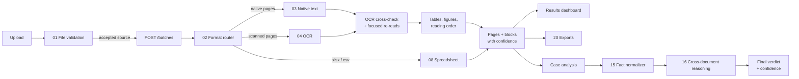

# ParseFusion

**Document and case intelligence: upload documents, extract every value with its exact location on the page, measure how much each value can be trusted, and compare documents against each other to find discrepancies — with every result traceable back to the source by hovering over it.**

Built for DataQuest 3.0.

---

## Contents

1. [What ParseFusion does](#1-what-parsefusion-does)
2. [Quick start (Windows)](#2-quick-start-windows)
3. [How it works: the pipeline](#3-how-it-works-the-pipeline)
4. [How confidence is measured](#4-how-confidence-is-measured)
5. [Cross-document reasoning](#5-cross-document-reasoning)
6. [Hover-to-source](#6-hover-to-source)
7. [The application, page by page](#7-the-application-page-by-page)
8. [The 24 agents and their status](#8-the-24-agents-and-their-status)
9. [API reference](#9-api-reference)
10. [Configuration](#10-configuration)
11. [Data storage and security](#11-data-storage-and-security)
12. [Project structure](#12-project-structure)
13. [Testing](#13-testing)
14. [Demo walkthrough](#14-demo-walkthrough)
15. [Troubleshooting](#15-troubleshooting)
16. [Known limitations](#16-known-limitations)

---

## 1. What ParseFusion does

| Capability | What you get |
|---|---|
| **Universal intake** | PDF (digital and scanned), images (PNG, JPG, TIFF, BMP, WebP, GIF), DOCX, PPTX, XLSX, CSV/TSV, EML (with attachments), HTML. Files are validated by content (magic bytes), not by extension; executables, macros, zip bombs and path traversal are rejected. |
| **Extraction with location** | Every text line, table cell and figure carries a bounding box on the rendered page image, the method that produced it (`native_text`, `ocr:tesseract`, `pdf_table_finder`, `spreadsheet`, …) and a confidence score. |
| **Measured confidence** | Native PDF text is checked against an independent OCR read of the same page. A value only scores high when the text layer and what is actually printed agree. Text hidden under a white box, broken font maps, or OCR misreads all lower the score and flag the value for review. |
| **Tables, figures, reading order** | Tables are reconstructed cell by cell; images on the page become figures (text inside them is OCR'd); two-column layouts are read column by column. |
| **Cross-document reasoning** | Facts (amounts, dates, rates) are normalized across documents and compared — only when currency, unit, period, basis and frequency all match. Differences beyond tolerance become findings with a severity and a confidence. No LLM: every number is computed by code. |
| **Hover-to-source** | Hover any value (fact, finding, table cell, citation, audit entry) to see the file, page, method, confidence, excerpt and a cropped thumbnail of the exact region. Click to open the full page with the box highlighted. |
| **Exports** | JSON, Markdown, CSV, XLSX, PDF, HTML, DOCX — each signed (Ed25519) with a content hash and a time-limited download link. |
| **Governance** | Append-only audit log, column-level access control, governed natural-language SQL chat, human approval for drafted actions. |

---

## 2. Quick start (Windows)

### Prerequisites

| Tool | Version | Notes |
|---|---|---|
| Python | 3.10 or newer | |
| Node.js | 22.12 or newer (22.22.2+ recommended for the test tools) | |
| **Tesseract OCR** | 5.x | **Required for OCR and for confidence cross-checking.** Install with the UB Mannheim Windows installer into the default folder `C:\Program Files\Tesseract-OCR`. ParseFusion finds it there automatically (or set `TESSERACT_CMD` to the full path of `tesseract.exe`). |

### 1. Backend (first terminal)

```cmd
cd C:\Users\Kannan\Desktop\dataquest3.0\ParseFusion_DataQuest
python -m venv .venv
.venv\Scripts\activate
pip install -r requirements-backend.txt
python -m uvicorn backend.main:app --port 8000
```

Check it: open <http://localhost:8000/health>. Every agent that loaded is listed under `mounted`; anything that failed to load is listed under `failed` with the reason.

> Use `--reload` only while editing backend code. With `--reload`, every saved `.py` file restarts the server. Data survives restarts (see [section 11](#11-data-storage-and-security)), but anything that was processing at that moment is marked *interrupted* and has to be retried.

### 2. Frontend (second terminal)

```cmd
cd C:\Users\Kannan\Desktop\dataquest3.0\ParseFusion_DataQuest
echo VITE_API_BASE_URL=http://localhost:8000> .env.local
npm install
npm run dev
```

Open <http://localhost:3000>.

`.env.local` only needs to be created once. If the frontend shows **"Backend not connected"**, the backend is not running or `VITE_API_BASE_URL` is wrong — the frontend never shows invented data in place of a backend response.

### Local demo roles and document requests

The local demo backend supports `admin` and `viewer` identities. The top-right identity menu can switch roles without restarting the backend and provides viewers a direct link to **Request document access**. This switch changes the identity for the entire backend instance, so it is for a single-user local demo only.

Alternatively, set these variables before starting the backend:

```cmd
set PARSEFUSION_DEMO_ROLE=viewer
set PARSEFUSION_DEMO_USER_ID=reader-1
```

Omit `PARSEFUSION_DEMO_ROLE` to use the default `admin` identity (`system`). Viewer requests are stored in the local ParseFusion store. Admins can approve or reject them from **Access Control → Documents & Requests**; an approval grants that viewer access to the document, and rejection leaves it locked. Request and decision notifications are sent to the configured `NTFY_TOPIC_ADMIN` topic, so the viewer must subscribe to that same ntfy topic to receive decision notifications.

This is a local-development role switch, not a login system: one running backend instance represents one identity at a time. Restart it with the other role to alternate between submitting a viewer request and reviewing it as admin. Do not expose this demo auth configuration to an untrusted network; production deployments must provide authenticated users and role assignment through a real identity provider.

---

## 3. How it works: the pipeline



### Step by step

1. **Upload → Agent 01 (file validation).** The file is streamed, hashed (SHA-256), its type detected from its bytes, and checked for safety (executables, Office macros, zip bombs, password protection). The original is stored encrypted (AES-256-GCM). The upload page shows *accepted* or *rejected* with the reason.
2. **Start pipeline → `POST /batches`.** Accepted sources are queued. Sources run in parallel, and the pages of each source run in parallel.
3. **Agent 02 (format router)** classifies every page: `native_text`, `scanned`, `mixed`, `blank` or `image_only`, detects rotation and script, and pre-renders page images only for pages that OCR needs (other page images are rendered on first view and cached).
4. **Extraction per page**
   - native pages → **Agent 03** reads the PDF text layer (lines with bounding boxes; hidden text is excluded and reported);
   - scanned pages → **Agent 04** runs OCR (Tesseract; deskew, binarisation, multi-language);
   - spreadsheets → **Agent 08** reads every cell (formulas, number formats, hidden rows, merged cells).
5. **Verification and structure** (`backend/page_analysis.py`)
   - OCR cross-check of native text, plus focused re-reads of regions the first OCR pass missed (see [section 4](#4-how-confidence-is-measured));
   - tables reconstructed from the PDF page, cell by cell;
   - figures from the image objects placed on the page; text inside them is recovered by OCR;
   - reading order by recursive XY-cut (columns before rows).
6. **Result**: a `SourceDocument` with pages and blocks — viewable on the Results dashboard, exportable, and available to case analysis.

Batch progress (`/batch`) shows the current stage (`format_router` → `extraction` → `exporting` → `completed`), progress percentage and per-source status, with a retry button for failed sources.

---

## 4. How confidence is measured

Confidence is never a constant. Every block carries `confidence` **and** a `confidence_breakdown` with the inputs that produced it, so the number can be checked.

### Native text (digital PDF, DOCX, PPTX)

```
confidence = native_quality × (native_weight + agreement_weight × agreement)
           = native_quality × (0.6 + 0.4 × agreement)            (default weights)
```

| Input | Meaning |
|---|---|
| `native_text_quality` | Agent 03's own score for the text layer: penalised for garbage characters (private-use glyphs, `U+FFFD`, `(cid:N)` tokens) and missing ToUnicode font maps. |
| `ocr_agreement` | Fuzzy similarity (0–1) between the native text and what OCR reads at the same location on the rendered page. |
| `ocr_engine_confidence` | Tesseract's own confidence for the matching OCR line (shown for transparency). |

Regions the full-page OCR did not cover (often rows of ruled tables or short isolated numbers) are **re-read on their own** — first per table row, then per cell or line, using just the glyph area so ruling lines don't confuse OCR. Only values that still disagree after that are marked `needs_review`.

**What this catches** — a test PDF with `Covered value: 9,999` painted over by a white rectangle: the text layer still contains it, OCR sees nothing printed, so it scores **0.60** and is flagged, while the visible lines score **1.00**.

**When both independent readers agree exactly, a score of 1.0 is correct** — it means the text layer and the printed page say the same thing.

### OCR-only text (scanned pages, text inside images)

`confidence` = the OCR engine's confidence for that line. Blocks recovered from inside images on native pages carry `text_layer_present: 0` in their breakdown.

### Other blocks

| Block | Confidence |
|---|---|
| Table | mean confidence of its non-empty cells (each cell scored like native text) |
| Figure | 1.0 for its *placement* (taken from the PDF object model); the text inside is scored separately |
| Spreadsheet cell | 1.0 with `read_from_file: 1.0` — values are read from the file, nothing is recognised |
| Page `reading_order_confidence` | share of blocks placed by a clean XY-cut rather than a fallback for overlapping boxes |
| Document confidence | mean of its block confidences |

`needs_review` is set when confidence is below the *low* band in `platform_config.json`, or when OCR agreement is below `agreement_review_below` (default 0.8).

If Tesseract is not installed, native text keeps only its text-layer quality and every affected page carries a `CONFIDENCE_NOT_CROSS_CHECKED` warning — the system says so instead of reporting a score it did not measure.

---

## 5. Cross-document reasoning

Run it from the **Case Analysis** page (sidebar) or with `POST /cases/{case_id}/analyze`.

### Stages

| Stage | Agent | Output |
|---|---|---|
| 1. Parsing | 01–04, 08 | Per document: route, pages, blocks by type and method, tables, figures, OCR agreement, reading-order confidence, items needing review, document confidence. |
| 2. Fact normalization | 15 | Facts: subject, metric, value as written, normalized value, currency, unit, period, basis (gross/net), frequency, the normalization rule used, confidence, evidence. |
| 3. Cross-document reasoning | 16 | Comparisons, not-comparable pairs with the reason, findings with severity, confidence, possible explanations and evidence. |
| Final | — | Verdict, final confidence and how it was computed. |

### How facts are found (agent 15)

- Values come from table rows (row label × column header) and text lines (`Label: value`, leader dots, `X is Y`).
- The **subject** (the person or party a value belongs to) comes from a name line: `Name:`, `Employee name:`, `Account holder:`, `Borrower:`, `Applicant:`, `Payee:`, `Customer name:` and similar. **A document without such a line produces facts without a subject, and those are never compared.**
- Periods (`Pay period:`, `Statement period:`), currencies, Indian/European number formats, `k/m/lakh/crore`, percentages and dates are normalized deterministically.
- Fact confidence = evidence confidence (from parsing) × penalties for anything assumed (approximate value 0.85, assumed locale 0.90, sentence pattern 0.90, block that needed review 0.80, range 0.50, …).
- Sensitive data (card numbers, Aadhaar, PAN, IBAN, keys, …) is masked; text that looks like a prompt-injection attempt is quarantined.

### How comparison works (agent 16)

1. Facts are grouped by normalized `(subject, metric)`; only facts from **different documents** are paired.
2. Every pair must pass all checks: `distinct_sources`, `numeric_values`, `currency_match`, `currency_grounded`, `unit_match`, `frequency_match`, `period_match`, `basis_match`, `category_match`. A failing pair is listed as *not comparable* with the reason (for example `Bases differ: gross vs net`) — currencies and frequencies are never converted.
3. Each fact's evidence is re-verified against the stored document (the excerpt must exist in the cited block, and the value must be found in the excerpt). Facts that fail are dropped with a warning.
4. `difference = |a − b|`, `percent = difference / max(|a|, |b|) × 100`. A **finding** is raised when both exceed tolerance (`tolerance_abs`, `tolerance_pct`).
5. Severity from thresholds (default: ≥ 10 % high, ≥ 2 % medium, else low).
6. Finding confidence = `min(confidence of the two facts) − penalties` (ambiguity notes, checks that passed only because both sides left a field unstated).

### Final result

| Verdict | Final confidence |
|---|---|
| `discrepancies_found` | mean confidence of the findings |
| `consistent` | mean confidence of the comparisons (each = the lower of its two facts' confidences) |
| `insufficient_data` | 0 — nothing could be compared |

**Example** — a salary certificate (`Employee name: Ravi Kumar`, `Pay period: September 2026`, `Net salary: INR 72,500`) and a bank statement (`Account holder: Ravi Kumar`, `Statement period: September 2026`, `Net salary: INR 65,000`):
one **high** finding (difference 7,500, 10.34 %, confidence 0.70); `Professional tax 200 = 200` within tolerance; `gross vs net salary` correctly reported as not comparable.

---

## 6. Hover-to-source

A shared component, `<EvidenceHover evidence={EvidenceReference}>`, wraps any value that has evidence: facts, findings, table cells, chat citations, action drafts, comparison panes and audit entries.

| Interaction | Behaviour |
|---|---|
| Hover or keyboard focus (300 ms) | Popover with file name, page, extraction method, confidence (as received), text excerpt and a cropped thumbnail of the region. Leaving before 300 ms cancels it. |
| Click popover / **Enter** | Opens the Source Viewer on that page with the box highlighted. |
| **Esc** | Closes the popover. |
| Touch | First tap shows the popover, second tap opens the viewer. |
| No bounding box | Whole-page thumbnail with the backend's `bbox_unavailable_reason`, no highlight box. |
| Locked / masked value | Only a "restricted" message — no excerpt, no thumbnail, nothing fetched. |
| Source Viewer | Hovering a block outline shows the same popover; hovering a value in the side panel highlights its box on the page and vice versa. |
| Tables | Hovering a cell highlights its box on the linked page image. |
| Case review / analysis | Hovering a fact, comparison or finding highlights all of its evidence boxes at once, each labelled with its document. |

Thumbnails are cropped client-side from the page image with CSS background positioning (no extra image requests unless the backend supplies a `crop_url`). Page images load lazily, crop geometry is cached per `(page_id, bbox)`, and an image that is already loaded is never fetched again. The popover has `role="tooltip"` and is linked with `aria-describedby`.

---

## 7. The application, page by page

| Page | Path | Purpose |
|---|---|---|
| Ingestion & Upload | `/` | Drop files or ingest a URL; each file is validated immediately (accepted/rejected with reason). Choose output formats, optionally a case, and start the pipeline. |
| Batch Pipeline | `/batch?id=…` | Live progress: stage, percentage, per-source status, retry, export download links. |
| Results Dashboard | `/dashboard?source_id=…` | Source Viewer (page image + boxes + block details with confidence breakdown and OCR alternative), Tables, Figures, Structured JSON, Warnings. |
| Case Review | `/cases` | Case documents, link suggestions, facts and findings side by side with evidence highlighting. |
| **Case Analysis** | `/case-analysis` | Runs and shows every stage: parsing per document → facts → comparisons / not comparable / findings → final verdict and confidence. |
| Action Review | `/actions` | Drafted follow-up actions and human approval. |
| Access Control | `/access` | Schema browser, column masking, access requests. |
| Exports | `/exports` | Create and download signed exports. |
| Audit Log | `/audit` | Append-only, hash-chained event log. |
| Metrics | `/metrics` | Sources/pages processed, throughput, mean confidence, blocks needing review. |
| Agent Status | `/agent-status` | Which agents are mounted and healthy. |

---

## 8. The 24 agents and their status

✅ running · ⚙️ role covered by the pipeline layer · ❌ not loaded

| # | Agent | Status | Notes |
|---|---|---|---|
| 01 | File validation | ✅ | `backend/agents/01_file_validation.py` |
| 02 | Format router | ✅ | page classes, rotation, pre-render of OCR pages |
| 03 | Native text | ✅ | |
| 04 | OCR | ✅ | Tesseract (PaddleOCR used if installed) |
| 05 | Layout detection | ⚙️ ❌ | file contains Python saved as `.ts`; figures/tables come from `page_analysis.py` |
| 06 | Reading order | ⚙️ ❌ | same; XY-cut in `page_analysis.py` |
| 07 | Table extraction | ⚙️ ❌ | same; PDF table finder in `page_analysis.py` |
| 08 | Spreadsheet | ✅ | |
| 09 | Chart / figure | ⚙️ ❌ | figures detected; charts are not digitised |
| 10 | Equations | ❌ | |
| 11 | JSON assembly | ⚙️ ❌ | `SourceDocument` assembled by `pipeline_api.py` |
| 12 | Confidence validation | ⚙️ ❌ | measured confidence from `page_analysis.py` |
| 13 | Virtual merge | ❌ | TS client only |
| 14 | Case linker | ✅ | |
| 15 | Fact normalizer | ✅ | |
| 16 | Cross-document reasoning | ✅ | |
| 17 | Action draft | ✅ | |
| 18 | Human approval | ✅ | |
| 19 | Audit | ✅ | SQLite, hash-chained |
| 20 | Export | ✅ | 7 formats, Ed25519-signed manifest |
| 21 | Extractor consensus | ⚙️ ❌ | OCR-vs-native agreement in `page_analysis.py` |
| 22 | URL guard / web ingest | ❌ | code sits in `src/agents/18_humanApproval.py` |
| 23 | Access control | ✅ | |
| 24 | Governed NL Chat SQL API | ✅ | API endpoint; no chat UI |

`GET /health` (backend) and the Agent Status page show the live state.

---

## 9. API reference

All responses use one envelope:

```json
{ "ok": true, "data": { }, "error": null, "request_id": "…" }
{ "ok": false, "data": null, "error": { "code": "NOT_FOUND", "message": "…", "details": {} }, "request_id": "…" }
```

### Platform

| Method | Path | Description |
|---|---|---|
| GET | `/health` | mounted / failed agents |
| GET | `/health/agents` | agent status for the UI |
| GET | `/config` | limits, accepted types, formats, confidence bands, severities, pipeline stages |
| GET | `/auth/me` | current user and capabilities |
| GET | `/metrics` | throughput and quality metrics |

### Pipeline

| Method | Path | Description |
|---|---|---|
| POST | `/agents/file-validation` | multipart upload (`file`) → `source_id`, status, detected type |
| POST | `/batches` | `{source_ids, output_formats?, case_id?}` → `{batch_id, job_id}` |
| GET | `/batches`, `/batches/{id}` | status, stage, progress, sources, exports |
| POST | `/batches/{id}/retry` | `{source_id}` |
| GET | `/jobs/{job_id}` | job status |
| GET | `/sources`, `/sources/{id}` | `SourceDocument` (with pages and blocks) |
| GET | `/sources/{id}/pages/{n}` | one `PageUnit` |
| GET | `/sources/{id}/pages/{n}/image` | rendered page (PNG) — bounding boxes refer to this image |
| GET | `/sources/{id}/pages/{n}/crop?bbox=x1,y1,x2,y2` | region of the page (PNG) |

### Cases

| Method | Path | Description |
|---|---|---|
| GET / POST | `/cases` | list / create `{title}` |
| GET | `/cases/{id}` | case record |
| POST | `/cases/{id}/sources` | `{source_ids}` — add processed documents to a case |
| POST | `/cases/{id}/analyze` | run fact normalization + cross-document reasoning; returns all stages and the final result |
| GET | `/cases/{id}/analysis` | last analysis |
| GET | `/actions`, `/actions/{id}` | drafted actions |

Agent endpoints (`/agents/...`) are listed at <http://localhost:8000/docs>. Full schemas: `docs/CONTRACT.md`.

---

## 10. Configuration

### `backend/platform_config.json`

| Section | Key | Default | Meaning |
|---|---|---|---|
| — | `poll_interval_ms` | 2000 | UI polling interval |
| — | `confidence_bands` | high ≥ 0.85, medium ≥ 0.6, low < 0.6 | colours and the review threshold |
| `consensus` | `ocr_cross_check` | `true` | OCR every native page to measure agreement (set `false` for speed) |
| | `native_weight` / `agreement_weight` | 0.6 / 0.4 | confidence formula weights |
| | `agreement_review_below` | 0.8 | agreement below this → `needs_review` |
| | `ocr_only_min_confidence` | 0.4 | minimum OCR confidence for text found only by OCR on native pages |
| | `min_figure_area` | 0.01 | share of the page an image must cover to count as a figure |
| | `max_region_rechecks_per_page` | 60 | budget for focused OCR re-reads |
| `agents.reasoning` | `tolerance_abs`, `tolerance_pct` | 0.01, 1.0 | when a difference becomes a finding |
| | `severity_thresholds` | high 10 %, medium 2 % | |
| | `confidence_penalties` | ambiguity 0.1, weak check 0.05 | |
| `agents.fact_normalizer` | `include_unverified_links` | `false` | use only confirmed case links |

Limits (file size, page count) and accepted types are reported by `GET /config` from agent 01.

### Environment variables

| Variable | Where | Purpose |
|---|---|---|
| `VITE_API_BASE_URL` | `.env.local` | backend URL for the frontend |
| `CORS_ORIGINS` | backend | allowed origins (default `http://localhost:3000,http://127.0.0.1:3000`) |
| `E_DATA_DB_URL` | backend | read-only SQLAlchemy URL for the governed catalog used by Access Control and the legacy Agent 24 SQL endpoint (for example `sqlite:///./catalog.db`) |
| `NTFY_ENABLED` | backend | Enable ntfy notifications (`1` by default) |
| `NTFY_BASE_URL` / `NTFY_TOPIC_ADMIN` | backend | ntfy server and topic; defaults to `https://ntfy.sh/dataquest` |
| `NTFY_TOKEN` | backend | Optional ntfy bearer token for private topics |
| `APP_BASE_URL` | backend | Optional UI origin used to make notification links clickable (for example `http://localhost:3000`) |
| `TESSERACT_CMD` | backend | path to `tesseract.exe` if not in the default folder |
| `PARSEFUSION_DATA_DIR` | backend | data folder (default `<project>/.pf_data`) |
| `PARSEFUSION_STORE` | backend | `sqlite` (default) or `memory` |
| `PARSEFUSION_DATA_KEY` | backend | 32-byte encryption key (base64 or hex); otherwise generated once into the data folder |
| `URL_SIGNING_KEY` | backend | key for export download links; otherwise generated once |
| `AGENT_DEBUG` | backend | `0` turns off the per-step debug log |

---

## 11. Data storage and security

- **Persistent store**: uploads, page images, pages/blocks, batches, cases and analyses are written to SQLite in `.pf_data/store.db` and survive restarts. Delete the `.pf_data` folder to start from an empty state. `.pf_data/` is in `.gitignore` — it holds keys; never commit it.
- **Encryption**: originals and page images are stored with AES-256-GCM (key in `.pf_data/data.key` or `PARSEFUSION_DATA_KEY`).
- **Signatures**: exports and approvals are signed with Ed25519 (`.pf_data/signing.key`); download links are HMAC-signed and expire.
- **Audit**: every agent run is appended to a hash-chained audit log (`e_audit.db`).
- **Prompt-injection and sensitive data**: document text is sanitised before it reaches reasoning or actions; card numbers, national IDs, keys and similar are masked.
- **Authentication**: not implemented yet — a single local demo user with all capabilities (`backend/common/auth.py`). Do not expose the backend publicly.

---

## 12. Project structure

```
ParseFusion_DataQuest/
├── backend/
│   ├── main.py                 FastAPI app: mounts every agent router + platform + pipeline
│   ├── platform_api.py         /config, /auth/me, /health/agents
│   ├── pipeline_api.py         batches, jobs, sources, pages, images, cases, case analysis, metrics
│   ├── page_analysis.py        OCR cross-check confidence, tables, figures, reading order
│   ├── platform_config.json    all tunable settings
│   ├── agents/                 01–04, 08, 18–20, 23, 24 (+ loaders for 14–17), shared helpers
│   └── common/                 store, crypto, config, auth, audit, errors, notify
├── common/                     alias package (`from common import …`) → backend/common
├── src/                        React 19 + TypeScript frontend
│   ├── agents/                 typed API clients per agent (+ Python for 14–18)
│   ├── api/                    HTTP client, envelope, config, sources, batches, cases, case analysis
│   ├── components/evidence/    hover-to-source (EvidenceHover, popover, thumbnails, highlights)
│   ├── components/viewer/      Source Viewer, SVG overlay, block details
│   ├── components/table/       table renderer with per-cell hover
│   ├── pages/                  one file per page (see section 7)
│   └── lib/evidence.ts         pure helpers: thumbnail geometry, positioning, image cache
├── tests/                      backend tests (pytest)
├── docs/CONTRACT.md            per-agent JSON contract
├── requirements-backend.txt
└── package.json
```

---

## 13. Testing

```cmd
:: backend (200 tests)
pip install -r requirements-dev.txt
python -m pytest -q tests

:: frontend (unit + component tests, type check, production build)
npm test
npx tsc --noEmit
npm run build
```

Tests run with an in-memory store, so they never touch `.pf_data`. OCR tests are skipped when Tesseract is not installed.

---

## 14. Demo walkthrough

1. **Start clean**: stop the backend, delete `.pf_data`, start the backend (no `--reload`) and the frontend.
2. **Upload** a digital PDF with a table, a scanned page or image, a CSV and an e-mail. Point out validation results (accepted, detected type, page count).
3. **Create a case** on the upload page, pick output formats (JSON, XLSX, PDF), start the pipeline; watch the batch page move through stages to *completed* with export links.
4. **Results dashboard**: open the PDF — hover blocks for the popover, open the block details to show the confidence breakdown (text-layer quality, OCR agreement, OCR confidence) and the OCR alternative; open the Tables and Figures tabs.
5. **Confidence that means something**: upload a PDF where a value is covered by a white box — it scores 0.60 and is flagged for review while visible text scores 1.00.
6. **Case Analysis**: with two documents about the same person and period (e.g. salary certificate and bank statement), click **Run analysis** — show parsing per document, the facts table, the comparison checks, the *gross vs net* "not comparable" decision, the high-severity finding with its confidence, and the final verdict. Hover a finding to see both evidence boxes on their pages.
7. **Exports and audit**: download the signed export; show the audit log entries for every step.

---

## 15. Troubleshooting

| Symptom | Cause and fix |
|---|---|
| "Backend not connected: /config" | Backend not running, or `.env.local` missing/wrong. Start the backend; `echo VITE_API_BASE_URL=http://localhost:8000> .env.local`; restart `npm run dev`. |
| `npm install` fails with ERESOLVE (esbuild / vite) | `esbuild` must be `^0.28.0` in `package.json` (already set). Delete `package-lock.json` and run `npm install` again. |
| Confidence is 1.0 everywhere and pages show `CONFIDENCE_NOT_CROSS_CHECKED` | Tesseract is not installed or not found. Install it to `C:\Program Files\Tesseract-OCR` or set `TESSERACT_CMD`. |
| `ENGINE_FALLBACK` warning | PaddleOCR is not installed, so Tesseract was used. Informational only. |
| `404` on `/batches/<id>` or `/sources/<id>` | That batch/source does not exist in the current data folder (for example after deleting `.pf_data`). Upload and run again. |
| Source shows "interrupted" | The backend restarted while it was processing. Use **Retry** on the batch page. |
| Case analysis: "insufficient data" | No facts could be paired. Each document needs a name line (`Employee name:`, `Account holder:` …), matching periods, and the same metric with the same basis (net vs gross). |
| Case analysis: "needs at least two processed sources" | Add documents to the case on the Case Analysis page or select the case when uploading. |
| `/health` lists an agent under `failed` | The reason is shown next to it; agents 05–07, 09–13, 21 are known not to load (see [section 8](#8-the-24-agents-and-their-status)). |
| Processing is slow | OCR is the cost (≈ 1–2 s per page, parallel across CPU cores). For long digital PDFs set `"ocr_cross_check": false` in `platform_config.json` (confidence then reflects text-layer quality only). |

---

## 16. Known limitations

- Agents 05–07, 09–13, 21 and 22 do not load (several contain Python saved with a `.ts` extension); their core roles for the demo are covered by `page_analysis.py` and `pipeline_api.py` as listed in section 8. Charts are detected as figures but not digitised; equations are not extracted.
- Authentication is a single local demo user.
- Reading order is geometric (XY-cut); unusual layouts may need agent 06.
- Fact normalization reads English labels; transposed tables (labels in the header row) are not read; fiscal quarters are not resolved.
- Cross-document comparison is exact on the normalized `(subject, metric)` — by design, a wrong merge is worse than a missed one.
